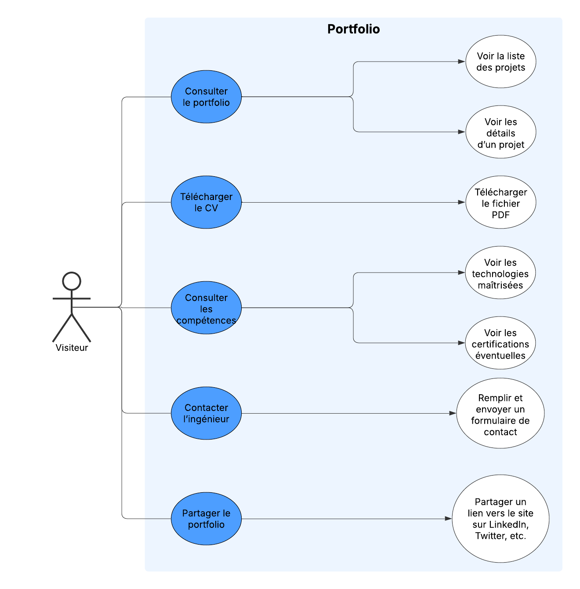

# Cahier des charges - Portfolio d'Ingénieur Informatique

## 1. Contexte
Le portfolio d'un ingénieur informatique vise à valoriser ses compétences techniques ainsi que les projets qu'il a réalisés. Il constitue une vitrine professionnelle essentielle pour capter l'attention des recruteurs, séduire des clients potentiels et établir des collaborations fructueuses. Grâce à une présentation claire et structurée, il met en avant son expertise et son savoir-faire, facilitant ainsi les opportunités professionnelles et les partenariats stratégiques.

## 2. Public cible
- Recruteurs et entreprises du secteur IT
- Clients potentiels pour des missions freelances
- Partenaires et collaborateurs

## 3. Exigences fonctionnelles

### User stories et cas d'acceptation

#### **User Story 1** - Consultation du portfolio
> En tant que visiteur, je veux pouvoir consulter les projets réalisés afin d’évaluer les compétences du propriétaire du portfolio.

**Cas d’acceptation** :
- Le visiteur peut voir une liste des projets avec une image, un titre et une description courte.
- Le visiteur peut cliquer sur un projet pour voir plus de détails.

#### **User Story 2** - Téléchargement du CV
> En tant que recruteur, je veux pouvoir télécharger le CV de l’ingénieur afin d’avoir un aperçu de son parcours professionnel.

**Cas d’acceptation** :
- Un bouton permet de télécharger le CV au format PDF.

#### **User Story 3** - Consultation des compétences
> En tant que visiteur, je veux pouvoir consulter les compétences de l’ingénieur afin de connaître ses technologies maîtrisées et ses certifications éventuelles.

**Cas d’acceptation** :
- Une section affiche les technologies maîtrisées.
- Une section liste les certifications obtenues (le cas échéant).

#### **User Story 4** - Contact avec l’ingénieur
> En tant que visiteur, je veux pouvoir contacter l’ingénieur via un formulaire afin de poser des questions ou proposer une collaboration.

**Cas d’acceptation** :
- Un formulaire de contact est disponible avec les champs : Nom, Email, Message.
- Une confirmation de l’envoi s'affiche après soumission.

#### **User Story 5** - Partage du portfolio
> En tant que visiteur, je veux pouvoir partager le portfolio sur des réseaux sociaux afin de le diffuser à d’autres personnes intéressées.

**Cas d’acceptation** :
- Un bouton permet de partager le portfolio sur LinkedIn, Twitter, etc.

### **Use Case** - Diagramme UML usecase

## 4. Technologies utilisées

### Technologies utilisées

#### Développement Front-End
- **HTML** : Structuration du contenu web.
- **CSS** : Mise en forme et style visuel des pages.
- **JavaScript** : Dynamisation des interactions utilisateur et gestion des événements.

#### Compatibilité Multi-Plateforme
- **Responsive Design** : Garantie d'une expérience utilisateur optimale sur des appareils mobiles et tablettes en adaptant le design à différentes tailles d'écran.

## 5. Charte graphique

| **Logo** | **Palette de couleurs** | **Typographies** |
|----------|-------------------------|------------------|
|  | - **Bleu profond** : HEX -> #2c3e50   - **Gris anthracite** : HEX -> #1e2a38   - **Crème** : HEX -> #fffaf1 | - **Titre** : Bebas Neue, sans-serif.    - **Texte** : Open Sans, sans-serif. |

## 6. Contraintes
### Réglementation
- **Mentions légales** :
  - Nom du propriétaire du site.
  - Hébergement et contact.
  
- **RGPD** :
  - Mise en place d’une politique de confidentialité détaillant l’utilisation des données collectées (formulaire de contact, cookies, analytics).
  - Consentement explicite pour l’utilisation des cookies.

- **SEO** :
  - Structure sémantique conforme aux bonnes pratiques (balises Hn, meta descriptions, balises alt sur les images).
  - Optimisation du temps de chargement (lazy loading, minification des ressources).
  - Création d'un sitemap XML pour faciliter l’indexation par les moteurs de recherche.